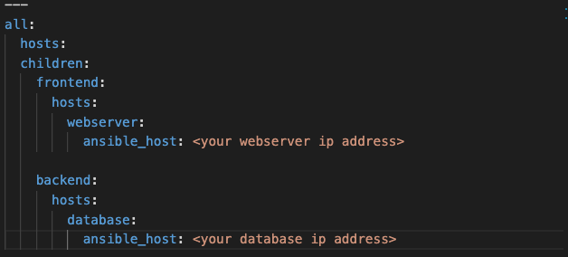
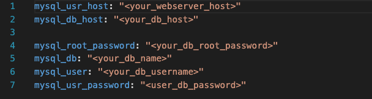

## **Wordpress Automation with Ansible**

### **Table of Content**

- [**Wordpress Automation with Ansible**](#wordpress-automation-with-ansible)
  - [**Table of Content**](#table-of-content)
  - [**Program Description**](#program-description)
  - [**Prerequisites**](#prerequisites)
  - [**How to Run the Code**](#how-to-run-the-code)
  - [**Code Mapping**](#code-mapping)
  - [**Useful Links**](#useful-links)

### **Program Description**

This program utilizes Ansible to install and configure servers for hosting WordPress. The program includes pre-defined playbooks and roles that automate the installation and configuration of necessary packages and settings. See the diagram below.  


### **Prerequisites**

Before running the program, ensure that:

- Ansible is installed on the local machine
    - To check if it’s installed, run   
            ```ansible --version```
    
- The target servers have SSH access
    - To check, run this command  
            ```ansible (target server IP) -m ping```
- The target servers have privileged users with the same username and sudo password
    - **target server 1** and **target server 2** have the same username as **the** **local machine** username
    - **target server 1** and **target server 2** have the same sudo password


### **How to Run the Code**

1. Clone the repository to the local machine
   - navigate to the directory where you want to clone
   - make sure that you have git installed
   - run this command  
           ```git clone https://github.com/burkanov-e/Wordpress-Automation-Ansible.git```
    
2. The inventory file should be properly configured with the target server information / IP Addresses
    - open wordpress/inventory.yml
    - change the IP Addresses for the database and the webserver
    
  
3. Update the `wordpress/vars/main.yml` variables
    - open wordpress/vars/main.yml
    - change variables with your database name, password, root password (quotations should remain)
    
        
    
    **Note:** This file contains sensitive information, please protect it with `ansible-vault` . In order to protect it, run  
    ```ansible-vault encrypt <path/to/vars/main.yml>```
    
4. Run the main.yml playbook 
    - **If wordpress/vars/main.yml is encrypted:**     
```ansible-playbook -i inventory.yml main.yml -K --ask-vault-pass```

    - **If not:**   
```ansible-playbook -i inventory.yml main.yml -K```

1. Connect to the database server and run this command   
            ```mysql_secure_installation```

    
    **Note:** Please provide root password that you provided in `wordpress/vars/main.yml`, otherwise the next step is going to fail. 
    
2. Run the `db-config-manual/db-config.yml`
    - Change your directory to `db-config-manual`
    - Run this command   
    ```ansible-playbook -i ../inventory.yml db-config.yml -K --ask-vault-pass```
 

### **Code Mapping**

```
wordpress
├── db-config-manual
│   └── db-config.yml
├── inventory.yml
├── main.yml
├── pre_tasks
│   ├── ping.yml
│   └── update.yml
├── roles
│   ├── db-packages
│   ├── web-configs
│   └── web-packages
└── vars
    └── main.yml

```


### **Useful Links**

- [What is the Ansible](https://www.freecodecamp.org/news/what-is-ansible/)
- [Ansible Playbooks](https://docs.ansible.com/ansible/latest/playbook_guide/playbooks_intro.html)
- [Ansible Conditionals](https://docs.ansible.com/ansible/latest/playbook_guide/playbooks_conditionals.html)
- [Ansible Roles](https://docs.ansible.com/ansible/latest/playbook_guide/playbooks_reuse_roles.html)
- [Ansible Vault](https://docs.ansible.com/ansible/2.8/user_guide/vault.html#:~:text=Ansible%20Vault%20is%20a%20feature,or%20placed%20in%20source%20control.)
 
